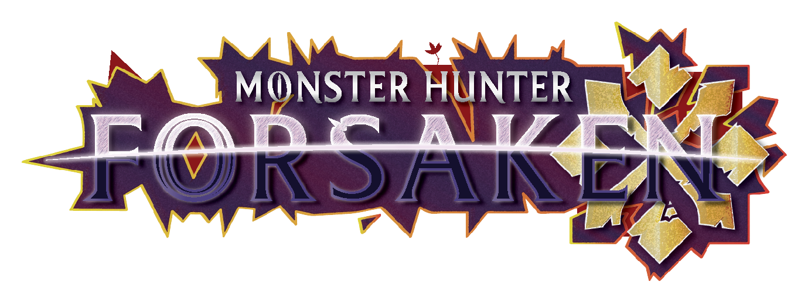

<html>
<body>

<h1>Monster Hunter Forsaken</h1>

<h2>Talisman Generator</h2>

<h3>Mystery Charm</h3>
<button type="button" >Pawn Talisman</button>

<button type="button" >Bishop Talisman</button>

<h3>Shining Charm</h3>
<button type="button" >Knight Talisman</button>

<button type="button" >Rook Talisman</button>

<h3>Timeworn Charm</h3>
<button type="button" >Queen Talisman</button>

<button type="button" >King Talisman</button>
</body>
<head>
    <meta charset="UTF-8">
    <meta name="viewport" content="width=device-width, initial-scale=1.0">
    <title>Text Generator</title>
    <link rel="stylesheet" href="styles.css"> <!-- Optional for styling -->
</head>
<body>
    <h1>Text Generator</h1>
    <input type="text" id="inputText" placeholder="Enter text">
    <button id="generateButton">Generate Text</button>
    

    
</body>

</html>
